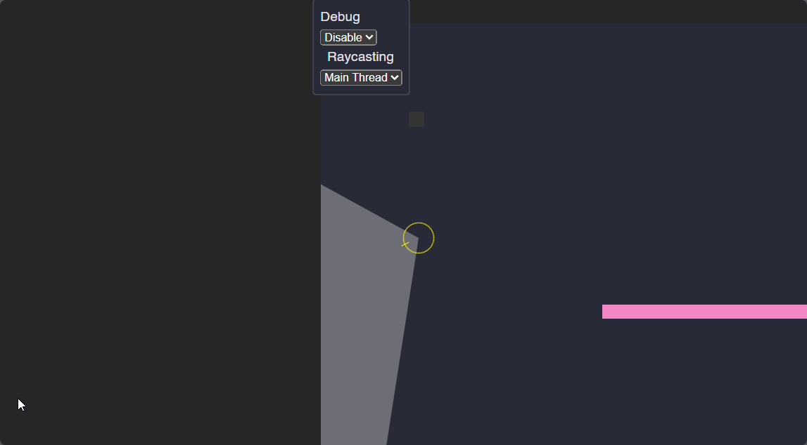

# 2D Raycasting with HTML, CSS & JavaScript (No Canvas)

> [!NOTE] 
> This was never meant to see the light of day, this is just some fun hacking away to see if I could even get this working without referencing best practice algorithms.

### Overview
A small prototype game to play with 2D Raycasting and line of sight using plain HTML, CSS and JavaScript.

This means that this implementation is only using DOM Elements, and we are not using the `<canvas>` element and it's API in anyway. This also does not use `WebGL` or any other implementations that are possible outside of native HTML, CSS and JavaScript.